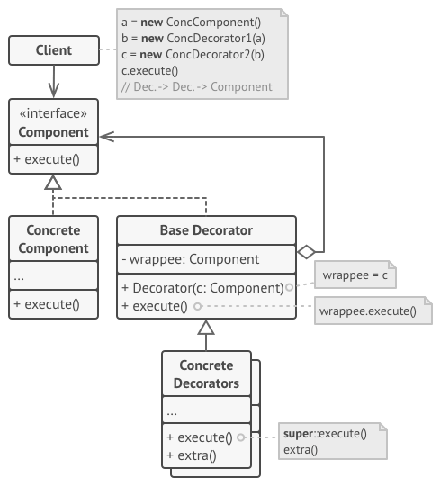

# Decorator

## Rôle

Ajouter des caractéristiques à une classe sans la modifier, ni utiliser des classes spécialisées après en avoir hérité.

## Fonctionnement

Le design pattern Decorator permet de construire simplement un objet complexe dont le comportement peut varier selon l'usage qui en est attendu au moment de l'exécution.

On peut enrichir les fonctionnalité d'un objet en utilisant successivement différents décorateurs, chacun d'entre eux fournissant à l'objet initial une caractéristique supplémentaire.

e.g. : un objet Pizza qui décrit les caractéristiques de le pâte et de la sauce tomate, un Decorator lui ajoute le fromage, un autre le jambon, encore un autre l'ananas (:scream:).  
Chaque Decorator doit également redéfinir en conséquence la méthode de calcul du prix de la pizza.

## Implémentation

- [exemple en TypeScript](./examples/decorator.ts "Decorator - exemple Typescript")
- [exemple en PHP](./examples/decorator.php "Decorator - exemple PHP")
