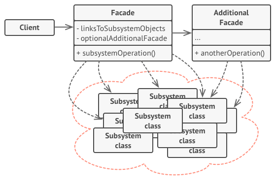

# Facade

## Rôle

Fournir un accès simplifié aux fonctionnalités de systèmes complexes.

## Fonctionnement

Une Facade est une classe qui simplifie l'usage de fonctionnalités complexes. Elle se charge de l'implémentation, qui peut nécessiter la coordination de plusieurs systèmes (e.g. classes, librairies tierces) et un enchaînement précis d'opérations (e.g. initialisations d'objets, conversion de données, etc.), pour mettre à disposition des méthodes simples à utiliser.

e.g. : la conversion d'une vidéo en un nouveau format nécessite l'emploi de différents systèmes spécialisés pour la lecture/écriture de fichiers, l'encodage vidéo, l'encodage audio, etc. Une Facade peut se charger de l'appel aux fonctionnalités des différents systèmes pour exposer une simple méthode `convert(filePath, outputFormat)`

## Implémentation

- [exemple en TypeScript](./examples/facade.ts "Facade - exemple Typescript")
- [exemple en PHP](./examples/facade.php "Facade - exemple PHP")
