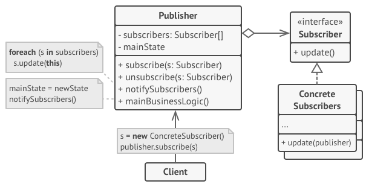

# Observer

## Rôle

Organiser la gestion des évènements.

## Fonctionnement

Le design pattern Observer permet de tenir à jour tout au long de l'exécution des objets dont le comportement dépend des changements d'état d'un autre.

L'objet dont l'état peut influencer le comportement des autres (Subject, Publisher), notifie à chaque changement chacun des objets qui l'observent (Observer, Subscriber).

Le Publisher dispose de deux méthodes qui permettent aux Subscribers de s'abonner ou de se désabonner aux notifications émises à chaque évènement et il stocke la liste de ses abonnés dans un tableau.

Le Subscriber implémente une méthode que le Publisher peut appeler pour le notifier d'un changement d'état et adapter son comportement en conséquence.

e.g. : un objet Youtuber décrit les caractéristique d'une chaîne de contenu vidéo en ligne qui possède un système de notifications auxquelles on peut s'abonner ou se désabonner (Publisher).  
Un objet Fan décrit un compte abonné qui dispose d'un espace notifications pouvant être mis à jour (Subscriber). Quand un Fan souscrit aux notifications, le Youtuber l'ajoute dans le tableau qui contient tous ses abonnés.  
Chaque semaine, le Youtuber publie une vidéo et provoque l'ajout d'une nouvelle entrée dans l'espace notifications de chacun de ses abonnés.

## Implémentation

- [exemple en TypeScript](./examples/observer.ts "Observer - exemple Typescript")
- [exemple en PHP](./examples/observer.php "Observer - exemple PHP")
