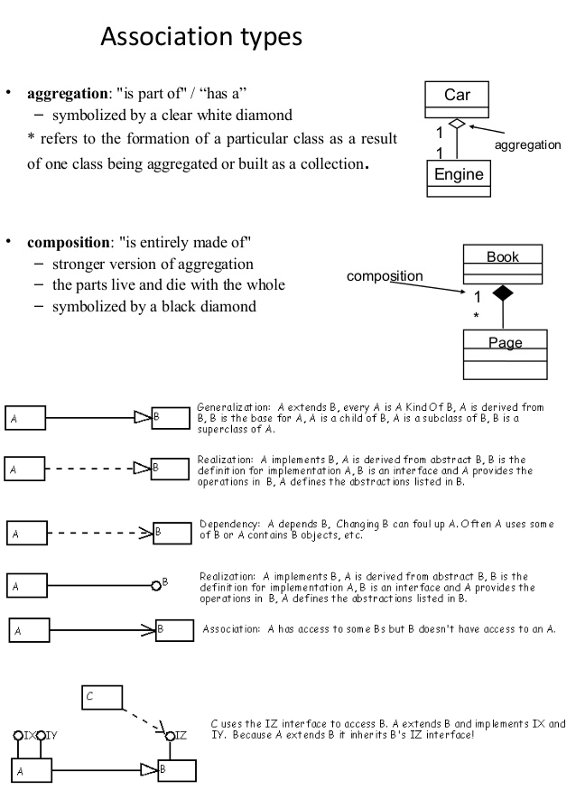

# Principes SOLID

- Single responsability:

Une classe ou une fonction doit avoir une seule responsabilité, n'effectuer qu'une seule tâche aux contours bien définis.

- Open/Closed:

Une classe doit être ouverte à l'extension mais fermée à la modification, il faut privilégier l'ajout de fonctionnalités par polymorphisme plutôt que par modifications de l'implémentation.

- Liskov substitution:

Une classe fille doit pouvoir se substituer à sa classe mère partout où elle est utilisée.
Ses méthodes ne doivent pas nécessiter comme paramètres des types plus spécialisés que ceux attendus par la classe mère, c'est à dire que si une méthode de la classe mère dépend d'une classe tierce, la méthode de la classe fille doit dépendre de cette même classe ou d'un ascendant. A l'inverse pour les types de retour, la classe fille doit fournir des types au moins aussi spécialisés que ceux fournis par la classe mère (i.e. même classe ou descendant). En PHP, le recours aux interfaces permet de lever une erreur en cas de non respect de ce principe.

- Interface segregation

Il ne faut pas hésiter à découper un comportement en une multitude d'interfaces afin que chacune soit cantonnée à un rôle très spécifique, et ainsi éviter qu'une classe ait besoin d'implémenter une interface sans avoir besoin de l'intégralité de ses méthodes.

- Dependency inversion

Les classes doivent dépendre des abstractions (interfaces, classes abstraites) plutôt que des implémentations. Cela favorise la flexibilité et les évolutions. En effet, une classe qui dépend d'une abstraction peut fonctionner avec n'importe quelle classe qui l'implémente.

## Relations dans les diagrammes de classe UML

